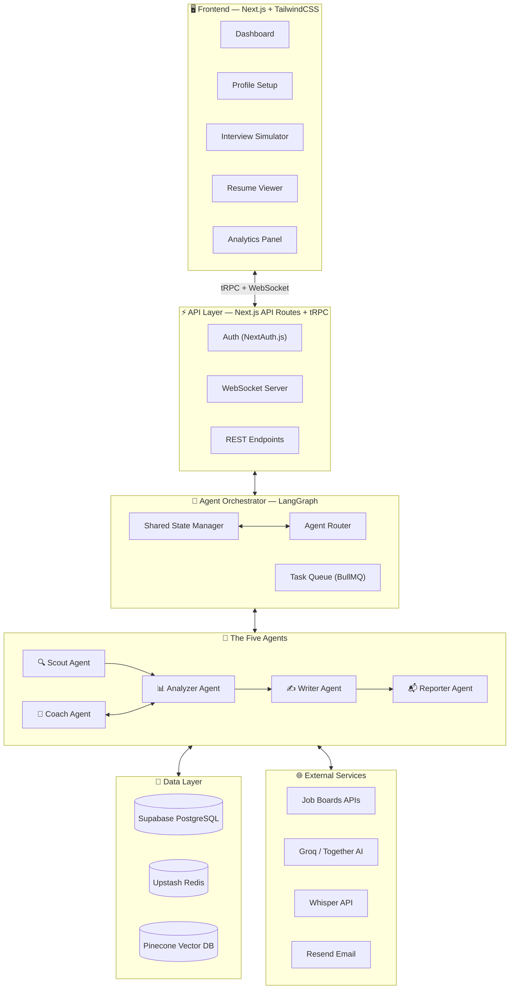
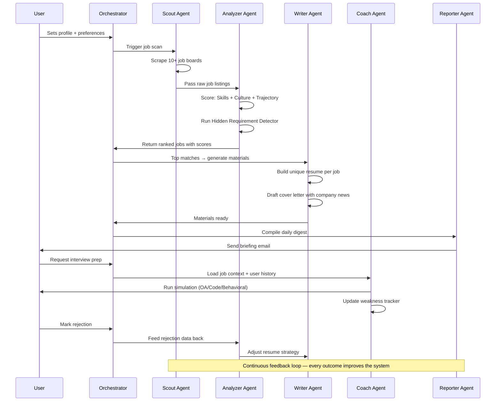
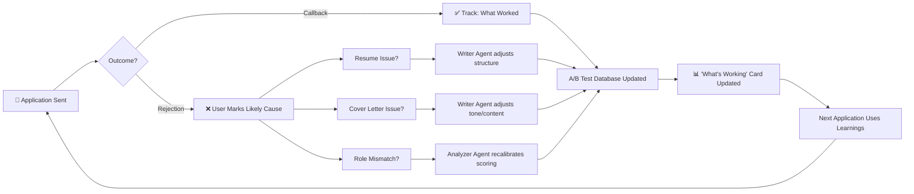
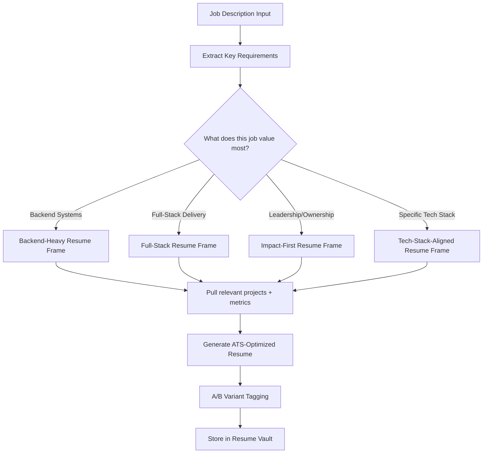
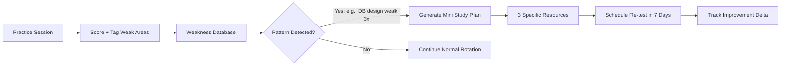
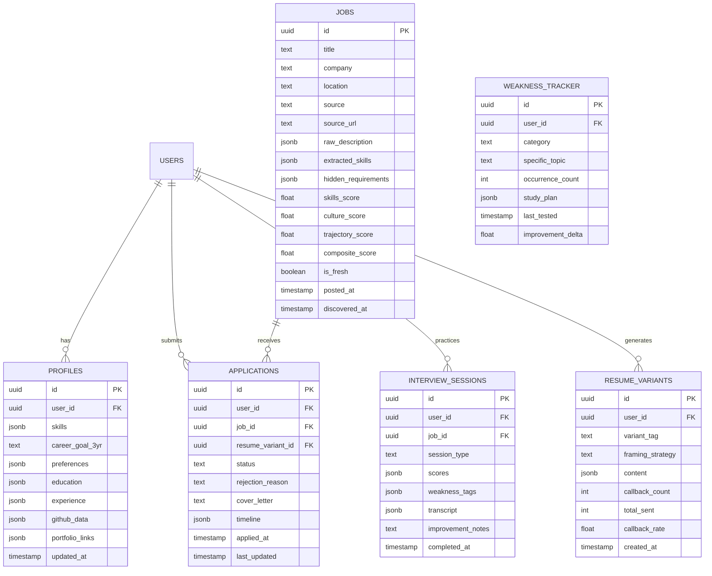

# CareerPilot — Complete Product Requirements Document

> **"You sleep. CareerPilot hunts."** — Your autonomous, AI-powered job-hunting teammate that learns, adapts, and evolves with every application, rejection, and interview.
> 

---

## 1. Product Vision & Identity

### 1.1 The Problem

Job hunting in 2026 is **broken**. Candidates spend 11+ hours per week on repetitive tasks — scrolling job boards, rewriting resumes, prepping for interviews they don't understand. 73% of applications go into a black hole. The process is manual, emotionally draining, and statistically inefficient.

### 1.2 The Solution

**CareerPilot** is a fully autonomous, multi-agent AI system that treats job hunting not as a checklist, but as a **continuous feedback loop**. Five specialized AI agents work 24/7 — scouting jobs, analyzing fit, tailoring resumes, coaching interviews, and reporting progress — while *learning from every outcome* to get smarter over time.

### 1.3 Core Differentiators

| **Feature** | **Traditional Tools** | **CareerPilot** |
| --- | --- | --- |
| Job Discovery | User manually searches | Agents monitor 10+ sources autonomously, flag jobs posted <24hrs |
| Resume Tailoring | Keyword swapping templates | Structurally unique resume per application with real company context |
| Interview Prep | Generic question banks | Company-specific OA, code round, and behavioral simulations with memory |
| Learning | Static — same output every time | Feedback loop: A/B tests resume formats, tracks weak spots, adapts |
| Transparency | Black-box recommendations | Every recommendation shows full reasoning chain |

### 1.4 Target Users

- **Primary:** CS/tech students and early-career developers (0-3 years experience) actively job hunting
- **Secondary:** Career switchers moving into tech roles
- **Tertiary:** Experienced developers passively exploring opportunities

---

## 2. System Architecture

### 2.1 High-Level Architecture Diagram



### 2.2 Agent Communication Flow



### 2.3 The Feedback Loop — The Killer Feature



---

## 3. The Five Agents — Deep Specification

### 3.1 🔍 Scout Agent

<aside>
🔍

**Mission:** Autonomously discover and flag the highest-potential job opportunities before anyone else applies.

</aside>

**Data Sources Monitored:**

| **Source** | **Method** | **Free Tier Approach** | **Frequency** |
| --- | --- | --- | --- |
| LinkedIn Jobs | Playwright scraping | Headless browser, rotating user agents | Every 6 hours |
| Glassdoor | Playwright scraping | Headless browser with stealth plugin | Every 12 hours |
| Wellfound (AngelList) | API + scraping | Public API endpoints | Every 6 hours |
| Otta | Playwright scraping | Headless browser | Every 12 hours |
| Himalayas | Public API | Free REST API | Every 6 hours |
| Remotive | Public API | Free REST API | Every 6 hours |
| GitHub Jobs | RSS + scraping | RSS feed parsing | Every 6 hours |
| Company Career Pages | Playwright + diff detection | User adds target company URLs | Every 24 hours |
| Hacker News (Who's Hiring) | HN API | Free API | Monthly thread |

**Key Behaviors:**

- **Freshness Priority:** Jobs posted <24 hours are flagged 🔥 *High Priority* (3× higher response rate statistically)
- **Deduplication:** Cross-source matching using company name + title + location fuzzy matching
- **Smart Filtering:** Pre-filters based on user preferences (remote/hybrid/onsite, salary range, visa sponsorship)
- **Rate Limiting:** Respects robots.txt, implements random delays (2-8 seconds), rotates headers

### 3.2 📊 Analyzer Agent

<aside>
📊

**Mission:** Score every discovered job on three dimensions and surface hidden requirements that job descriptions don't explicitly state.

</aside>

**Three-Dimensional Scoring:**

1. **Skills Match Score (0-100)**
    - Extracts required/preferred skills from JD using NLP
    - Maps against user's skill profile with proficiency levels
    - Weighs "required" skills 2× vs "nice to have"
    - Detects skill synonyms (e.g., "React" = "ReactJS" = "React.js")
2. **Culture Fit Score (0-100)**
    - Analyzes Glassdoor reviews (overall rating, work-life balance, management)
    - Checks company size preference alignment
    - Evaluates tech stack modernity from engineering blog/GitHub
    - Flags red flags (high turnover mentions, recent layoffs in news)
3. **Career Trajectory Score (0-100)**
    - Compares role responsibilities against user's 3-year goal
    - Evaluates growth potential (title progression, learning opportunities mentioned)
    - Checks if the role builds skills the user *wants* to develop

**Hidden Requirement Detector:**

- Identifies implied experience levels ("fast-paced environment" = likely expects senior-level autonomy)
- Flags salary red flags ("competitive salary" with no range = often below market)
- Detects cultural signals ("we work hard and play hard" = potential overtime expectations)
- Surfaces tech stack implications not listed (e.g., "microservices architecture" implies Docker/K8s knowledge)

### 3.3 ✍️ Writer Agent

<aside>
✍️

**Mission:** Generate a structurally unique, compelling resume and cover letter for every application — not template swaps, but genuinely different documents.

</aside>

**Resume Generation Strategy:**



**Cover Letter Intelligence:**

- Scrapes recent company news (funding rounds, product launches, press) via free news APIs
- References a specific, real event in the opening paragraph
- Matches tone to company culture (formal for enterprise, conversational for startups)
- Auto-inserts relevant GitHub repos or portfolio links matched to job requirements

**Resume A/B Testing (Feedback Loop Integration):**

- Each resume gets a variant tag (e.g., `backend-heavy-v3`, `fullstack-impact-v2`)
- Tracks callback rates per variant
- After 10+ applications, shows statistical confidence on which framing works best
- Auto-adjusts default framing based on winning variants

### 3.4 🎯 Coach Agent

<aside>
🎯

**Mission:** Prepare the user for every interview stage with company-specific, adaptive simulations that remember weaknesses and track improvement.

</aside>

**Three Simulation Modes:**

- **Mode 1: OA (Online Assessment) Simulation**
    - Sources problem difficulty from community databases (LeetCode discuss, Glassdoor interview sections, Blind)
    - Maps company to typical difficulty tier (Google = Hard, mid-stage startup = Medium)
    - Timed environment matching actual OA constraints
    - Supports Python, JavaScript, Java, C++ with real-time syntax validation
    - Provides hints system: Hint 1 (conceptual nudge) → Hint 2 (approach suggestion) → Hint 3 (partial solution)
    - Post-problem analysis: time complexity review, edge case coverage, optimal solution comparison
- **Mode 2: Live Code Round Simulation**
    - AI acts as a realistic interviewer — not just a problem presenter
    - **Interrupts** to ask clarifying questions mid-solution
    - **Redirects** if you go down an inefficient path ("What if the input was 10^6 elements?")
    - Evaluates: problem-solving approach, communication clarity, code quality, handling of edge cases
    - Supports collaborative coding environment with shared editor
    - Post-round scorecard: Communication (A-F), Problem Solving (A-F), Code Quality (A-F), Time Management (A-F)
- **Mode 3: Behavioral Round Simulation (Voice-Enabled)**
    - Voice input via Whisper speech-to-text
    - Analyzes spoken answers for:
        - **Pace:** Words per minute (optimal: 130-160 WPM)
        - **Filler words:** "um", "like", "you know" frequency
        - **Confidence markers:** Hedging language detection ("I think maybe..." vs "I implemented...")
        - **STAR framework adherence:** Situation → Task → Action → Result completeness
    - After each answer: provides a rewritten "gold standard" version
    - Asks user to **try again** with the improved version
    - Tracks improvement across sessions

**Interview Memory System:**



### 3.5 📬 Reporter Agent

<aside>
📬

**Mission:** Deliver a daily intelligence briefing — not a job list, but an actionable strategic summary.

</aside>

**Daily Digest Structure:**

1. **🏆 Top 3 Matches** — Each with a one-sentence "Why this fits you" explanation
2. **📊 Application Pipeline** — Visual status: Applied → Screening → Interview → Offer
3. **📈 What's Working Card** — Resume variant performance, callback rates, improvement trends
4. **💡 Today's Interview Tip** — Personalized to the next company you're interviewing with
5. **🔥 Fresh Opportunities** — Jobs posted in last 24 hours matching your profile
6. **📅 Upcoming** — Scheduled mock interviews, application deadlines, follow-up reminders

---

## 4. Free-Tier Tech Stack (Prototype)

<aside>
💰

All tools below have **free tiers** sufficient for prototyping and demo. Total cost: **$0** for development and initial users.

</aside>

| **Layer** | **Technology** | **Free Tier Limits** | **Purpose** |
| --- | --- | --- | --- |
| **Frontend** | Next.js 14 + TailwindCSS + shadcn/ui | Unlimited (open source) | SSR, app router, beautiful UI components |
| **Hosting** | Vercel | 100GB bandwidth, serverless functions | Deploy frontend + API routes |
| **Auth** | NextAuth.js (Auth.js) + Supabase Auth | 50,000 MAU (Supabase) | Google/GitHub OAuth, session management |
| **Database** | Supabase (PostgreSQL) | 500MB database, 1GB file storage | User profiles, jobs, applications, analytics |
| **Vector DB** | Pinecone | 100K vectors, 1 index | Semantic job matching, skill similarity |
| **Cache/Queue** | Upstash Redis + Upstash QStash | 10K commands/day, 500 messages/day | Caching, job queue for agent tasks |
| **LLM** | Groq (Llama 3.3 70B) + Together AI | Groq: 14.4K tokens/min; Together: $1 free credit | All agent reasoning, generation, analysis |
| **Agent Orchestration** | LangGraph (Python) or LangChain.js | Unlimited (open source) | Multi-agent state management, handoffs |
| **Scraping** | Playwright | Unlimited (open source) | JS-heavy career page scraping |
| **Speech-to-Text** | Whisper.cpp (local) or Groq Whisper API | Unlimited local / Groq free tier | Behavioral interview voice analysis |
| **Email** | Resend | 100 emails/day, 3,000/month | Daily digest delivery |
| **Real-time** | Supabase Realtime or Pusher | Supabase included / Pusher: 200K messages | Live dashboard updates, agent activity feed |
| **CRON Jobs** | Vercel CRON or GitHub Actions | Vercel: 2 cron jobs; GH Actions: 2000 min/month | Scheduled agent runs, daily digests |
| **Monitoring** | Sentry + Vercel Analytics | 5K errors/month (Sentry) | Error tracking, performance monitoring |

### 4.1 Architecture Decision: Monorepo Structure

```
career-pilot/
├── apps/
│   ├── web/                    # Next.js 14 frontend
│   │   ├── app/
│   │   │   ├── (auth)/         # Login, signup pages
│   │   │   ├── (dashboard)/    # Main app pages
│   │   │   ├── api/            # tRPC + REST routes
│   │   │   └── layout.tsx
│   │   └── components/
│   │       ├── ui/             # shadcn components
│   │       ├── dashboard/      # Dashboard widgets
│   │       ├── interview/      # Interview simulator
│   │       └── resume/         # Resume viewer/editor
│   └── agents/                 # Python agent service
│       ├── orchestrator.py     # LangGraph orchestration
│       ├── agents/
│       │   ├── scout.py
│       │   ├── analyzer.py
│       │   ├── writer.py
│       │   ├── coach.py
│       │   └── reporter.py
│       ├── tools/              # Agent tools (scraping, etc.)
│       └── state.py            # Shared state schema
├── packages/
│   ├── db/                     # Supabase schema + migrations
│   ├── types/                  # Shared TypeScript types
│   └── utils/                  # Shared utilities
├── turbo.json
└── package.json
```

---

## 5. Database Schema



---

## 6. Detailed User Flows

### 6.1 Complete User Journey Map

```mermaid
flowchart TD
    START(["🌐 User Visits CareerPilot"]) --> AUTH{"Authenticated?"}
    AUTH -->|"No"| LOGIN["Login / Sign Up"]
    AUTH -->|"Yes"| DASH["Dashboard"]
    LOGIN --> ONBOARD["Onboarding Flow"]
    
    ONBOARD --> O1["Step 1: Basic Info"]
    O1 --> O2["Step 2: Upload Resume / Import LinkedIn"]
    O2 --> O3["Step 3: Skills Assessment"]
    O3 --> O4["Step 4: Career Goals (3-year vision)"]
    O4 --> O5["Step 5: Job Preferences"]
    O5 --> O6["Step 6: Connect GitHub (optional)"]
    O6 --> DASH
    
    DASH --> |"Auto-runs"| SCOUT_FLOW
    DASH --> |"User clicks"| JOB_DETAIL
    DASH --> |"User clicks"| INTERVIEW_FLOW
    DASH --> |"User clicks"| ANALYTICS_FLOW
    DASH --> |"User pastes URL"| QUICK_APPLY
    
    subgraph SCOUT_FLOW["🔍 Scout Flow (Autonomous)"]
        S1["Scout scrapes job boards"] --> S2["Deduplicates listings"]
        S2 --> S3["Passes to Analyzer"]
        S3 --> S4["Analyzer scores + ranks"]
        S4 --> S5["Jobs appear on Dashboard"]
    end
    
    subgraph JOB_DETAIL["📋 Job Detail Flow"]
        J1["View job card"] --> J2["See 3-dimension score breakdown"]
        J2 --> J3["View hidden requirements"]
        J3 --> J4["See AI reasoning for ranking"]
        J4 --> J5{"Apply?"}
        J5 -->|"Yes"| J6["Writer generates resume + cover letter"]
        J6 --> J7["User reviews + edits"]
        J7 --> J8["Download PDF / Copy to clipboard"]
        J8 --> J9["Mark as Applied"]
        J9 --> J10["Track in pipeline"]
    end
    
    subgraph INTERVIEW_FLOW["🎯 Interview Prep Flow"]
        I1["Select company + role"] --> I2{"Choose mode"}
        I2 -->|"OA"| I3["Timed coding challenge"]
        I2 -->|"Code Round"| I4["Live coding with AI interviewer"]
        I2 -->|"Behavioral"| I5["Voice-enabled STAR practice"]
        I3 --> I6["Post-session scorecard"]
        I4 --> I6
        I5 --> I6
        I6 --> I7["Weakness tracking updated"]
        I7 --> I8{"Weak area detected?"}
        I8 -->|"Yes"| I9["Mini study plan generated"]
        I8 -->|"No"| I10["Continue practice"]
    end
    
    subgraph ANALYTICS_FLOW["📈 Analytics Flow"]
        A1["View application pipeline"] --> A2["See callback rates by resume variant"]
        A2 --> A3["View 'What's Working' card"]
        A3 --> A4["Track interview improvement over time"]
    end
    
    subgraph QUICK_APPLY["⚡ Quick Apply (Demo Flow)"]
        Q1["Paste job URL"] --> Q2["Scout extracts JD"]
        Q2 --> Q3["Analyzer scores in real-time"]
        Q3 --> Q4["Writer generates resume in ~60s"]
        Q4 --> Q5["Coach prepares 1 mock question"]
        Q5 --> Q6["Reporter drafts follow-up email"]
        Q6 --> Q7["All ready in 90 seconds"]
    end
```



### 6.2 Onboarding Flow (Detailed)

**Step 1 — Welcome & Auth (30 seconds)**

- Google or GitHub OAuth (one-click signup)
- "What brings you here?" — select: Active job hunting / Passive exploring / Interview prep only

**Step 2 — Profile Import (60 seconds)**

- Option A: Upload existing resume (PDF) → AI extracts all data
- Option B: Import from LinkedIn URL → AI scrapes public profile
- Option C: Manual entry (fallback)
- AI parses and displays extracted data for confirmation

**Step 3 — Skills Assessment (90 seconds)**

- AI presents extracted skills as tags
- User rates each: *Beginner / Intermediate / Advanced / Expert*
- User adds missing skills
- AI suggests related skills: "You listed React — do you also know Next.js, Redux, or React Native?"

**Step 4 — Career Vision (60 seconds)**

- "Where do you want to be in 3 years?" — Free text or select:
    - Senior Engineer at a top tech company
    - Tech Lead / Engineering Manager
    - Founding Engineer at a startup
    - Specialized role (ML, Security, DevOps, etc.)
    - Custom goal

**Step 5 — Job Preferences (45 seconds)**

- Work mode: Remote / Hybrid / On-site / Any
- Location preferences (if hybrid/on-site)
- Company size: Startup (<50) / Mid (50-500) / Large (500+) / Any
- Salary expectation range (optional)
- Visa sponsorship needed: Yes / No
- Industries to include/exclude

**Step 6 — Connect GitHub (30 seconds, optional)**

- OAuth connect to GitHub
- AI analyzes: top languages, contribution frequency, notable repos
- Identifies projects that strengthen the profile

---

## 7. User Interface — Screen-by-Screen Specification

### 7.1 Global Layout

```
┌─────────────────────────────────────────────────────────┐
│  🚀 CareerPilot               [Search] [🔔] [Avatar ▾] │
├──────────┬──────────────────────────────────────────────┤
│          │                                              │
│  📊 Dashboard  │                                        │
│  🔍 Jobs       │         MAIN CONTENT AREA              │
│  📝 Applications│                                       │
│  🎯 Interview  │                                        │
│  ✍️ Resumes    │                                        │
│  📈 Analytics  │                                        │
│  ⚙️ Settings   │                                        │
│          │                                              │
├──────────┴──────────────────────────────────────────────┤
│  🤖 Agent Activity: Scout found 12 new jobs • 2 min ago │
└─────────────────────────────────────────────────────────┘
```

**Design System:**

- **Framework:** shadcn/ui + Radix primitives
- **Colors:** Dark mode default, light mode toggle. Primary: Indigo (#6366F1). Accent: Emerald (#10B981)
- **Typography:** Inter for UI, JetBrains Mono for code
- **Motion:** Framer Motion for page transitions, agent activity animations

### 7.2 Dashboard (Home Screen)

<aside>
🏠

The dashboard is the command center. Everything the user needs is visible at a glance, with real-time agent activity streaming in.

</aside>

```
┌──────────────────────────────────────────────────────────────────┐
│  Good evening, Anurag 👋                                         │
│  CareerPilot found 8 new matches today • 3 applications pending  │
├──────────────────────────────────────────────────────────────────┤
│                                                                  │
│  ┌─── ⚡ QUICK APPLY ─────────────────────────────────────────┐  │
│  │  [Paste a job URL here...]                    [🚀 Go]      │  │
│  └────────────────────────────────────────────────────────────┘  │
│                                                                  │
│  ┌─── 🏆 TOP 3 MATCHES ──────────────────────────────────────┐  │
│  │  1. Senior Backend Engineer — Stripe         [92% match]   │  │
│  │     "Perfect skills overlap + they value distributed..."   │  │
│  │  2. Full-Stack Developer — Vercel            [88% match]   │  │
│  │     "Aligns with your Next.js expertise and..."            │  │
│  │  3. Software Engineer — Notion               [85% match]   │  │
│  │     "Career trajectory match: technical leadership..."     │  │
│  └────────────────────────────────────────────────────────────┘  │
│                                                                  │
│  ┌─── 📊 PIPELINE ─────────┐  ┌─── 📈 WHAT'S WORKING ──────┐  │
│  │  Discovered    │  47     │  │  📄 Resume Variant          │  │
│  │  Applied       │  12     │  │  ✅ Backend-heavy: 33% CB   │  │
│  │  Screening     │   3     │  │  ⚠️ Fullstack: 18% CB      │  │
│  │  Interviewing  │   1     │  │  Suggestion: Lead with      │  │
│  │  Offered       │   0     │  │  backend experience.        │  │
│  └─────────────────────────┘  └─────────────────────────────┘  │
│                                                                  │
│  ┌─── 🤖 AGENT ACTIVITY (Live) ──────────────────────────────┐  │
│  │  🔍 Scout: Scanning Wellfound... found 3 new listings     │  │
│  │  📊 Analyzer: Scoring "SDE-2 at Razorpay" — 79% match     │  │
│  │  ✍️ Writer: Resume ready for Stripe application            │  │
│  │  📬 Reporter: Daily digest scheduled for 8:00 AM           │  │
│  └────────────────────────────────────────────────────────────┘  │
│                                                                  │
│  ┌─── 🎯 NEXT UP ────────────────────────────────────────────┐  │
│  │  Mock interview: System Design @ Google — Tomorrow 4PM     │  │
│  │  💡 Tip: Google asks 40% system design. Focus on scaling   │  │
│  │  read-heavy systems.                              [Start]  │  │
│  └────────────────────────────────────────────────────────────┘  │
└──────────────────────────────────────────────────────────────────┘
```

### 7.3 Job Discovery Page

```
┌──────────────────────────────────────────────────────────────────┐
│  🔍 Jobs  [All ▾] [Remote ▾] [Posted: 24h ▾] [Sort: Match ▾]    │
├──────────────────────────────────────────────────────────────────┤
│                                                                  │
│  ┌────────────────────────────────────────────────────────────┐  │
│  │ 🔥 NEW  Senior Backend Engineer — Stripe                  │  │
│  │ San Francisco (Remote OK) • $180-220K • Posted 4 hours ago │  │
│  │                                                            │  │
│  │ ┌──────────┐ ┌──────────┐ ┌──────────┐                    │  │
│  │ │Skills: 92│ │Culture:87│ │Career: 94│  Overall: 92%      │  │
│  │ └──────────┘ └──────────┘ └──────────┘                    │  │
│  │                                                            │  │
│  │ ⚠️ Hidden Req: "Distributed systems" implies Kafka/gRPC   │  │
│  │ 💡 Why: Matches 9/11 skills, posted <24h, trajectory ✓    │  │
│  │                                                            │  │
│  │ [View Details]  [⚡ Quick Apply]  [🎯 Prep Interview]     │  │
│  └────────────────────────────────────────────────────────────┘  │
│                                                                  │
│  ┌────────────────────────────────────────────────────────────┐  │
│  │ Full-Stack Developer — Vercel                              │  │
│  │ Remote • $150-190K • Posted 18 hours ago                   │  │
│  │ Skills: 88 | Culture: 91 | Career: 84 | Overall: 88%      │  │
│  │ [View Details]  [⚡ Quick Apply]  [🎯 Prep Interview]     │  │
│  └────────────────────────────────────────────────────────────┘  │
│  ...                                                             │
└──────────────────────────────────────────────────────────────────┘
```

### 7.4 Job Detail Page

```
┌──────────────────────────────────────────────────────────────────┐
│  ← Back to Jobs                                                  │
│                                                                  │
│  Senior Backend Engineer — Stripe                     [⚡ Apply] │
│  San Francisco (Remote OK) • $180-220K • 🔥 Posted 4 hours ago  │
│                                                                  │
│  ┌─── MATCH BREAKDOWN ──────────────────────────────────────┐   │
│  │  Skills Match         ████████████████████▒▒  92/100     │   │
│  │  ✅ Python, Go, PostgreSQL, Redis, Kafka, AWS, Docker    │   │
│  │  ⚠️ Missing: Terraform (nice-to-have)                    │   │
│  │                                                          │   │
│  │  Culture Fit          █████████████████▒▒▒▒▒  87/100     │   │
│  │  Glassdoor: 4.2★ • WLB: 3.8 • Engineering culture: A+   │   │
│  │                                                          │   │
│  │  Career Trajectory    █████████████████████▒  94/100     │   │
│  │  "This role builds directly toward your goal of          │   │
│  │   technical leadership in distributed systems"           │   │
│  └──────────────────────────────────────────────────────────┘   │
│                                                                  │
│  ┌─── ⚠️ HIDDEN REQUIREMENTS ───────────────────────────────┐   │
│  │  • "Fast-paced" → Likely expects high autonomy, quick    │   │
│  │    shipping cycles                                       │   │
│  │  • "Distributed systems" → Implies Kafka, gRPC, service  │   │
│  │    mesh experience beyond what's listed                   │   │
│  │  • No salary listed but Levels.fyi suggests $180-220K    │   │
│  └──────────────────────────────────────────────────────────┘   │
│                                                                  │
│  ┌─── 💡 AI REASONING ──────────────────────────────────────┐   │
│  │  "Ranked #1 because: matches 9 of your 11 listed skills, │   │
│  │  the company's engineering blog suggests they value       │   │
│  │  distributed systems work, Glassdoor reviews mention      │   │
│  │  strong mentorship culture, and it was posted 4 hours ago │   │
│  │  (3x higher response rate in first 24 hours)."            │   │
│  └──────────────────────────────────────────────────────────┘   │
│                                                                  │
│  [✍️ Generate Resume]  [📝 Draft Cover Letter]  [🎯 Mock Interview] │
└──────────────────────────────────────────────────────────────────┘
```

### 7.5 Interview Simulator Page

```
┌──────────────────────────────────────────────────────────────────┐
│  🎯 Interview Simulator                                         │
│                                                                  │
│  Preparing for: Senior Backend Engineer @ Stripe                 │
│                                                                  │
│  ┌──────────────┐ ┌──────────────┐ ┌──────────────┐             │
│  │  💻 OA Sim   │ │  🖥️ Code     │ │  🎙️ Behavioral│             │
│  │  Timed DSA   │ │  Live Coding │ │  Voice STAR   │             │
│  │  problems    │ │  with AI     │ │  Practice     │             │
│  │  [Start]     │ │  [Start]     │ │  [Start]      │             │
│  └──────────────┘ └──────────────┘ └──────────────┘             │
│                                                                  │
│  ┌─── 📊 YOUR STATS ────────────────────────────────────────┐   │
│  │  Sessions completed: 14                                   │   │
│  │  Overall improvement: +23% from first session             │   │
│  │                                                           │   │
│  │  Strengths          │  Weaknesses                         │   │
│  │  ✅ Array/String     │  ⚠️ System Design (DB scaling)     │   │
│  │  ✅ Trees/Graphs     │  ⚠️ Behavioral (quantifying impact)│   │
│  │  ✅ Dynamic Prog     │  ⚠️ Concurrency patterns           │   │
│  │                      │                                    │   │
│  │  📚 Study Plan: Database Scaling                          │   │
│  │  1. "Designing Data-Intensive Applications" Ch. 5-6       │   │
│  │  2. YouTube: System Design — Database Sharding            │   │
│  │  3. Practice: Design a distributed cache (re-test Fri)    │   │
│  └───────────────────────────────────────────────────────────┘   │
└──────────────────────────────────────────────────────────────────┘
```

### 7.6 Resume Vault Page

```
┌──────────────────────────────────────────────────────────────────┐
│  ✍️ Resume Vault                              [+ Generate New]   │
│                                                                  │
│  ┌─── 📊 A/B PERFORMANCE ───────────────────────────────────┐   │
│  │                                                           │   │
│  │  Backend-Heavy v3    ████████████▒▒▒  33% callback  ✅    │   │
│  │  Full-Stack v2       █████████▒▒▒▒▒▒  18% callback  ⚠️   │   │
│  │  Impact-First v1     ██████████▒▒▒▒▒  22% callback       │   │
│  │                                                           │   │
│  │  💡 Insight: Backend-heavy framing outperforms by 83%.    │   │
│  │  Recommendation: Lead with systems/infrastructure exp.    │   │
│  └───────────────────────────────────────────────────────────┘   │
│                                                                  │
│  ┌────────────────────────────────────────────────────────────┐  │
│  │ 📄 Resume for Stripe — Backend-Heavy v3                    │  │
│  │ Generated: 2 hours ago • Status: Ready                     │  │
│  │ Company news used: "Stripe's $1B ARR milestone (Mar 2026)"│  │
│  │ [Preview] [Download PDF] [Edit] [Send to Email]            │  │
│  └────────────────────────────────────────────────────────────┘  │
│                                                                  │
│  ┌────────────────────────────────────────────────────────────┐  │
│  │ 📄 Resume for Vercel — Full-Stack v2                       │  │
│  │ Generated: Yesterday • Status: Applied                     │  │
│  │ [Preview] [Download PDF] [Track Application]               │  │
│  └────────────────────────────────────────────────────────────┘  │
└──────────────────────────────────────────────────────────────────┘
```

### 7.7 Analytics Page

```
┌──────────────────────────────────────────────────────────────────┐
│  📈 Analytics                                    [Last 30 days ▾]│
├──────────────────────────────────────────────────────────────────┤
│                                                                  │
│  ┌─────────────┐ ┌─────────────┐ ┌─────────────┐ ┌────────────┐│
│  │ Jobs Found  │ │ Applied     │ │ Callback %  │ │ Interviews ││
│  │    147      │ │    23       │ │    26%      │ │     4      ││
│  │  ↑12% vs LM │ │  ↑8% vs LM │ │  ↑5% vs LM │ │  ↑2 vs LM  ││
│  └─────────────┘ └─────────────┘ └─────────────┘ └────────────┘│
│                                                                  │
│  ┌─── APPLICATION FUNNEL ───────────────────────────────────┐   │
│  │  Discovered ██████████████████████████████  147           │   │
│  │  Applied    █████████████                    23           │   │
│  │  Callback   ██████                            6           │   │
│  │  Interview  ████                              4           │   │
│  │  Offer      █                                 1           │   │
│  └──────────────────────────────────────────────────────────┘   │
│                                                                  │
│  ┌─── INTERVIEW PROGRESS ──────┐ ┌─── TOP SOURCES ──────────┐  │
│  │  [Line chart: Session score │ │  LinkedIn:    42 jobs     │  │
│  │   over time, trending up]   │ │  Wellfound:   31 jobs     │  │
│  │                             │ │  Otta:        28 jobs     │  │
│  │  Coding:     72 → 88 (+22%) │ │  HN:          19 jobs     │  │
│  │  System Des: 45 → 62 (+38%) │ │  Direct:      16 jobs     │  │
│  │  Behavioral: 68 → 81 (+19%) │ │  Glassdoor:   11 jobs     │  │
│  └─────────────────────────────┘ └──────────────────────────┘  │
└──────────────────────────────────────────────────────────────────┘
```

---

## 8. API Endpoints Specification

### 8.1 Authentication

| **Method** | **Endpoint** | **Description** |
| --- | --- | --- |
| POST | `/api/auth/signup` | Register with email or OAuth |
| POST | `/api/auth/login` | Login with credentials or OAuth |
| POST | `/api/auth/logout` | Destroy session |
| GET | `/api/auth/session` | Get current session |

### 8.2 Profile

| **Method** | **Endpoint** | **Description** |
| --- | --- | --- |
| GET | `/api/profile` | Get user profile |
| PUT | `/api/profile` | Update profile |
| POST | `/api/profile/import-resume` | Upload and parse resume PDF |
| POST | `/api/profile/import-linkedin` | Import LinkedIn profile |
| POST | `/api/profile/connect-github` | Connect GitHub via OAuth |

### 8.3 Jobs

| **Method** | **Endpoint** | **Description** |
| --- | --- | --- |
| GET | `/api/jobs` | List discovered jobs (paginated, filterable) |
| GET | `/api/jobs/:id` | Get job detail with full scoring breakdown |
| POST | `/api/jobs/quick-scan` | Paste a URL → instant analysis |
| POST | `/api/jobs/:id/apply` | Generate resume + cover letter for this job |
| POST | `/api/jobs/:id/dismiss` | Dismiss a job (trains the model) |

### 8.4 Applications

| **Method** | **Endpoint** | **Description** |
| --- | --- | --- |
| GET | `/api/applications` | List all applications with status |
| PUT | `/api/applications/:id` | Update status (applied, screening, rejected, etc.) |
| POST | `/api/applications/:id/rejection-feedback` | Submit rejection cause → feeds learning loop |

### 8.5 Interview

| **Method** | **Endpoint** | **Description** |
| --- | --- | --- |
| POST | `/api/interview/start` | Start a session (OA/Code/Behavioral) |
| POST | `/api/interview/:sessionId/submit` | Submit answer for evaluation |
| POST | `/api/interview/:sessionId/voice` | Submit audio for Whisper transcription |
| GET | `/api/interview/history` | Get all sessions + scores + weakness tracker |
| GET | `/api/interview/study-plan` | Get current personalized study plan |

### 8.6 Resumes

| **Method** | **Endpoint** | **Description** |
| --- | --- | --- |
| GET | `/api/resumes` | List all resume variants with performance data |
| GET | `/api/resumes/:id` | Get resume content + metadata |
| GET | `/api/resumes/:id/pdf` | Download as PDF |
| GET | `/api/resumes/analytics` | A/B test results + recommendations |

### 8.7 WebSocket Events

| **Event** | **Direction** | **Payload** |
| --- | --- | --- |
| `agent:activity` | Server → Client | Real-time agent status updates for activity feed |
| `job:new` | Server → Client | New job discovered, with score preview |
| `resume:ready` | Server → Client | Resume generation complete |
| `interview:message` | Bidirectional | Real-time interview simulation messages |

---

## 9. Implementation Roadmap

### Phase 1: Foundation (Week 1-2) — MVP Core

- [ ]  Project setup: Next.js 14 + TailwindCSS + shadcn/ui + Supabase
- [ ]  Auth: NextAuth.js with Google + GitHub OAuth
- [ ]  Database schema: Supabase migrations for all tables
- [ ]  Profile: Onboarding flow with resume upload + parsing (Groq LLM)
- [ ]  Scout Agent v1: Scrape 3 sources (Wellfound, Himalayas, Remotive)
- [ ]  Basic dashboard with job listing display

### Phase 2: Intelligence (Week 3-4) — Agent Core

- [ ]  LangGraph orchestrator: State management + agent handoffs
- [ ]  Analyzer Agent: 3-dimension scoring + hidden requirement detection
- [ ]  Writer Agent: Resume generation with structural variation
- [ ]  Cover letter generation with company news integration
- [ ]  Job detail page with full score breakdown + AI reasoning
- [ ]  Pinecone integration for semantic skill matching

### Phase 3: Interview Engine (Week 5-6)

- [ ]  Coach Agent: OA simulation with timed coding environment
- [ ]  Code round simulation with AI interviewer personality
- [ ]  Behavioral round: Whisper integration for voice analysis
- [ ]  Weakness tracking system + study plan generation
- [ ]  Interview history + progress analytics

### Phase 4: Feedback Loop + Polish (Week 7-8)

- [ ]  Rejection feedback system → Writer/Analyzer learning
- [ ]  Resume A/B testing engine + "What's Working" card
- [ ]  Reporter Agent: Daily digest email via Resend
- [ ]  Real-time agent activity feed (WebSocket/Supabase Realtime)
- [ ]  Analytics dashboard with funnel visualization
- [ ]  Quick Apply flow (paste URL → 90-second demo sequence)

### Phase 5: Scale + Launch (Week 9-10)

- [ ]  Add remaining Scout sources (LinkedIn, Glassdoor, Otta)
- [ ]  Performance optimization + caching (Upstash Redis)
- [ ]  Error monitoring (Sentry)
- [ ]  Landing page + waitlist
- [ ]  Documentation + README
- [ ]  Deploy to production

---

## 10. The Hackathon Demo Script (90 Seconds)

<aside>
🎬

**The Wow Moment:** This is the sequence that wins judges over. Practice this until it's flawless.

</aside>

1. **0:00** — Open CareerPilot dashboard. Show the live agent activity feed streaming.
2. **0:10** — Paste a real Stripe job URL into Quick Apply.
3. **0:15** — Watch in real-time: Scout extracts the JD, Analyzer scores it (show the 3-dimension breakdown appearing live).
4. **0:30** — AI reasoning appears: "This job was ranked highly because..." — judges see transparency.
5. **0:40** — Writer generates a tailored resume. Show it side-by-side with the JD — highlight how the emphasis shifted.
6. **0:55** — Cover letter appears — point out the real Stripe news reference.
7. **1:05** — Click "Mock Interview" — show an OA question at Stripe's known difficulty level.
8. **1:15** — Switch to behavioral mode — speak an answer — show real-time voice analysis.
9. **1:25** — Show the "What's Working" card — explain the feedback loop in one sentence.
10. **1:30** — End with: *"This all happened while you were watching. Imagine what it does while you sleep."*

---

## 11. Success Metrics

| **Metric** | **Target (3 months)** | **How Measured** |
| --- | --- | --- |
| User Callback Rate | >25% (vs industry avg 8%) | User-reported application outcomes |
| Time to First Application | <5 minutes from signup | Onboarding → first "Apply" event |
| Interview Score Improvement | +30% after 10 sessions | Coach Agent scoring data |
| Daily Active Users | 500 DAU (beta) | Vercel Analytics |
| Resume A/B Convergence | Statistical significance in 10 apps | Callback rate per variant |
| Agent Uptime | >99.5% | Sentry + health checks |

---

## 12. Risk Mitigation

| **Risk** | **Impact** | **Mitigation** |
| --- | --- | --- |
| Job board scraping blocked | High | Use multiple sources, respect rate limits, prioritize API-first sources, implement proxy rotation |
| LLM free tier rate limits | Medium | Queue system via Upstash QStash, cache responses, use smaller models for simple tasks |
| Inaccurate job scoring | Medium | User feedback loop corrects scores over time, manual override always available |
| Voice analysis latency | Low | Use Groq's Whisper (fastest inference), process in chunks, show interim feedback |
| Resume quality inconsistency | Medium | Human review step before sending, A/B testing validates quality objectively |
| Data privacy concerns | High | All data encrypted at rest (Supabase), user can delete all data, no data shared with third parties |

---

*Built with 🧠 by CareerPilot — Because your next job shouldn't cost you your sanity.*